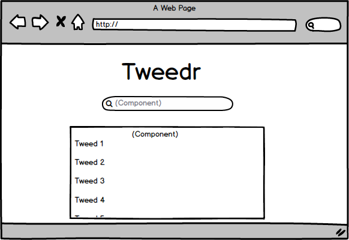
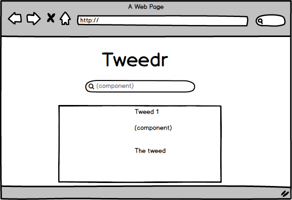

## Tweedr

A web application that mocks the features of the popular Twitter application.

## Wireframes

## User Stories

- A user should be able to input a tweed and see that tweed updated live on the front-page of the web application.

- A user should be able to click on an individual tweed and see solely that tweed. 

## Technologies

- React
- JavaScript
- postgreSQL
- Express
- HTML
- CSS
- Heroku

## Minimum Viable Product
- A web application that pulls tweeds from a database.

- A user should be able to input a tweed into the database using the web application.

- Upon clicking an individual tweed, a user should be taken to a new route path that displays only that individual tweed.

## Major Hurdles

-Working with the Axios module represented a major hurdle for the team.

## Author(s)
Kyle Frable

Dashiell Lumas

Ed O'Connell
